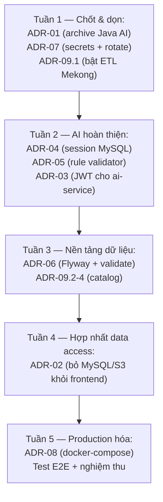

# KẾ HOẠCH CHỐT KIẾN TRÚC — Mekong WebGIS

> Ngày lập: 2026-08-30
> Phạm vi: chốt các quyết định kiến trúc (ADR) cho toàn hệ thống, ưu tiên giải quyết xung đột "2 implementation AI song song" và các rủi ro bảo mật/kiến trúc đã phát hiện.
> Nguyên tắc: mỗi quyết định có **Quyết định / Lý do / Việc cần làm / Tiêu chí nghiệm thu**. Không làm song song 2 hướng.

---

## 0. Bức tranh hiện trạng (tóm tắt bằng chứng)

| Thành phần | Hiện trạng | Vấn đề chính |
|---|---|---|
| `backend/` Spring Boot 4.0.6 / Java 17 :8084 | API chính, JWT, S3, GIS metadata | Credential cứng `root/1111`, `ddl-auto: update`, migration thủ công, AI-in-Java dở dang 15% |
| `frontend/` Next.js 15 :3004 | OpenLayers + TiTiler + AI chat UI | Next server routes truy cập **trực tiếp MySQL + S3** (`lib/db.ts`, `api/mysql/route.ts`) |
| `ai-service/` FastAPI :8090 | Planner → Tools → Analyst → Reviewer, SSE | Session in-memory, chưa có auth, `rule_validator` chưa nối |
| `datacenter/` Node ETL | Ecowitt 15 phút (chạy), Mekong (disable) | Credential cứng, cron tự viết |
| Lưu trữ | MySQL `mekong` + S3 `backup.hci.vn` (COG) | — |
| Triển khai | `manage.sh` (PID files), không docker-compose | Fragile cho production |

---

## 1. ADR-01 — AI chỉ tồn tại ở `ai-service/` (Python), ngừng phát triển AI trong Java

**Quyết định:** `ai-service/` (FastAPI) là **duy nhất** hệ AI chat/phân tích. Toàn bộ code AI trong backend Java (GroqConfig, DTO, `DataQueryService` phần AI, entities `ai_*` nếu không dùng) bị **đóng băng — không phát triển thêm**, đánh dấu deprecated trong `docs/AI_IMPLEMENTATION_STATUS.md`.

**Lý do:** Python đã hoàn thiện orchestrator, tool routing, GIS engine, peer-review, SSE streaming — vượt xa 15% của bản Java. Giữ 2 hướng gây drift schema prompt/DTO và tốn công bảo trì kép.

**Việc cần làm:**
1. Cập nhật `docs/AI_IMPLEMENTATION_STATUS.md`: ghi rõ "SUPERSEDED by ai-service/, archived 2026-08-30".
2. Di chuyển phần Java AI chưa dùng vào nhánh `archive/java-ai` (hoặc xóa nếu đã commit trên git).
3. Giữ lại **bảng MySQL `ai_conversation`/`ai_session`** (migration V006) — sẽ được ADR-04 tái sử dụng.

**Nghiệm thu:** không còn code AI active trong `backend/src`; status doc ghi rõ quyết định.

---

## 2. ADR-02 — Một lối vào dữ liệu duy nhất: Spring Backend

**Quyết định:** Frontend (Next.js) **không được** truy cập MySQL/S3 trực tiếp. Mọi đọc/ghi dữ liệu nghiệp vụ đi qua REST API của Spring Boot (`:8084`). Next API routes chỉ giữ vai trò **proxy** (auth cookie, rewrite, cache header) — không chứa logic DB.

**Lý do:** loại bỏ trùng lặp data access, thu hẹp bề mặt lộ credential, một chỗ enforce phân quyền.

**Việc cần làm:**
1. Kiểm kê các route Next gọi trực tiếp DB/S3: `api/mysql/route.ts`, `api/ecowitt/*`, `api/mekong-monthly/*`, `api/s3-list`, `api/data/[filename]`, `lib/db.ts`.
2. Với mỗi route: tạo/thiếu endpoint tương ứng ở Spring → chuyển route Next thành proxy thuần hoặc xóa.
3. Gỡ `mysql2` và `@aws-sdk/client-s3` khỏi `frontend/package.json` khi không còn dùng.
4. TiTiler vẫn được phép đọc S3 trực tiếp (nó là tile server, không phải frontend).

**Nghiệm thu:** `grep -r "mysql2\|aws-sdk" frontend/src` chỉ còn proxy; không có credential DB trong `frontend/.env*`.

---

## 3. ADR-03 — Auth hợp nhất: JWT của Spring là chuẩn, ai-service xác thực lại

**Quyết định:**
- JWT do Spring phát hành (đã có) là **nguồn chân lý duy nhất** cho identity/role.
- `ai-service` **verify JWT** (đọc public key hoặc chia sẻ secret qua env) trên mọi endpoint trừ `/health`; role `USER` trở lên mới được chat.
- Frontend chuyển JWT từ localStorage sang **httpOnly cookie** (qua Next proxy) khi có điều kiện — ưu tiên trung bình, làm sau ADR-02.

**Việc cần làm:**
1. Thêm dependency `PyJWT` vào `ai-service/requirements.txt`; middleware verify `Authorization: Bearer` (secret từ env `JWT_SECRET` — cùng nguồn với backend).
2. Bỏ CORS "allow all", whitelist đúng origin frontend.
3. Ghi log `session_id + user` vào `ai_conversation` (ADR-04).

**Nghiệm thu:** gọi `/chat` không token → 401; token hết hạn → 401; UI hiển thị đúng user trong hội thoại.

---

## 4. ADR-04 — Session AI lưu bền vào MySQL (tái dùng bảng V006)

**Quyết định:** thay `InMemoryChatMessageHistory` bằng persistence MySQL: bảng `ai_session` (session, user, created_at) + `ai_conversation` (session_id, role, content, metadata JSON, created_at). Cửa sổ ngữ cảnh vẫn 10 lượt khi build prompt.

**Lý do:** mất hội thoại khi restart là lỗi chức năng thực tế; bảng đã có sẵn từ migration V006 — chi phí thấp.

**Việc cần làm:**
1. Viết `ai-service/memory/mysql_store.py` (PyMySQL, đã có dependency) implement cùng interface với `session_store.py`.
2. Cấu hình qua env: `AI_SESSION_STORE=memory|mysql` (mặc định `mysql` ở prod, `memory` khi dev/test).
3. Endpoint `GET /chat/history/{session_id}` để frontend khôi phục hội thoại.

**Nghiệm thu:** restart ai-service → hội thoại cũ vẫn load được; prompt vẫn giới hạn 10 lượt.

---

## 5. ADR-05 — Chống hallucination: Rule Validator chạy TRƯỚC AI Reviewer

**Quyết định:** pipeline chuẩn hóa: `Analyst → rule_validator (deterministic, 0 token) → reviewer_ai (LLM) → PASS/FAIL`. Cả hai phải PASS mới stream ra.

**Việc cần làm:**
1. Nối `peer_review/rule_validator.py` vào `orchestrator/orchestrator.py` ngay sau Analyst.
2. FAIL bởi rule → retry Analyst không tốn token reviewer; log lý do FAIL vào metadata SSE.
3. Bổ sung rule: mọi con số trong báo cáo phải xuất hiện trong evidence JSON.

**Nghiệm thu:** test case "NO_DATA nhưng trả lời có số" bị chặn 100%.

---

## 6. ADR-06 — Schema migration: Flyway là chuẩn, tắt `ddl-auto: update`

**Quyết định:** thêm **Flyway** vào Spring Boot; các file `backend/db/mysql/V00*.sql` trở thành baseline; Hibernate chỉ `validate` ở prod (`ddl-auto: validate`), `update` chỉ cho dev local.

**Việc cần làm:**
1. Thêm `flyway-core` + `flyway-mysql` vào `pom.xml`; cấu hình baseline-on-migrate.
2. Đổi `application.yaml`: profile `prod` → `ddl-auto: validate`, `show-sql: false`.
3. Quy ước mới: mọi thay đổi schema = file `V0xx__*.sql` mới, không sửa file cũ.

**Nghiệm thu:** `mvn spring-boot:run` trên DB sạch tạo đúng schema; DB cũ migrate không lỗi.

---

## 7. ADR-07 — Bảo mật nền tảng: hết credential cứng

**Quyết định:** mọi secret qua biến môi trường / `.env` (git-ignored). Không có secret nào trong source.

**Việc cần làm (checklist quét):**
- [ ] `backend/src/main/resources/application.yaml`: DB user/pass, JWT secret, S3 key → `${ENV:}` không default yếu.
- [ ] `scripts/download-s3-gis.py`: S3 credentials → env.
- [ ] `datacenter/mekong/fetch-mekong-data.mjs`: password Rynan → env.
- [ ] `datacenter/ecowitt/fetch-ecowitt-data.mjs`: đã qua env — xác nhận lại.
- [ ] Tạo `.env.example` đầy đủ ở root + từng service; thêm `.env` vào `.gitignore`.
- [ ] Xoay (rotate) toàn bộ key đã từng commit: MySQL, S3, Groq, Rynan, Ecowitt.

**Nghiệm thu:** `grep -rn "1111\|AKIA\|password.*=.*['\"]" --include="*.{java,py,mjs,ts,yaml}"` sạch; secret cũ đã rotate.

---

## 8. ADR-08 — Triển khai: docker-compose là chuẩn production

**Quyết định:** đóng gói 4 service (backend, frontend, ai-service, titiler) + MySQL vào `docker-compose.yml`; `manage.sh` giữ lại cho dev local.

**Việc cần làm:**
1. Viết `Dockerfile` cho backend (multi-stage Maven→JRE 17), frontend (Next standalone), ai-service (python:3.11-slim + GDAL/rasterio).
2. `docker-compose.yml`: healthcheck, volume cho MySQL, network nội bộ, env từ `.env`.
3. TiTiler: chỉ bật khi `NEXT_PUBLIC_USE_TITILER=true`.

**Nghiệm thu:** `docker compose up -d` trên máy sạch chạy đủ hệ thống; `manage.sh` không còn là đường deploy chính.

---

## 9. ADR-09 — Dữ liệu: dọn catalog và bật lại ETL Mekong

**Quyết định:** `config/data_catalog.yaml` là **nguồn chân lý** về dataset; sửa các lệch đã phát hiện.

**Việc cần làm:**
1. Bật lại ETL Mekong: đổi `_mekong` → `mekong` trong `datacenter/config/schedule.json`, chạy thử 1 chu kỳ, xác nhận upsert vào MySQL.
2. Cập nhật `flood.latest_year` (đang 2000) theo dữ liệu thực tế trong S3.
3. Ghi chú rõ trong catalog: `salinity`/`ph` = raster S3; `do`/`turbidity` = point MySQL — và lộ trình hợp nhất (dài hạn: tất cả tham số nước về 1 nguồn).
4. Bỏ hardcode đường dẫn vector Trà Vinh/Cang Long trong `waterway` → tham số hóa.

**Nghiệm thu:** Planner chọn đúng tool cho câu hỏi về độ mặn (S3 raster) và DO (MySQL); ETL Mekong ghi được dòng mới vào DB.

---

## 10. Lộ trình thực thi (thứ tự phụ thuộc)

**Ưu tiên nếu thiếu thời gian:** ADR-01 → ADR-07 → ADR-04 → ADR-05 là bộ tối thiểu để hệ AI "chốt" được; ADR-02/08 có thể dời.

---

## 11. Tiêu chí nghiệm thu tổng (Definition of Done)

1. Chỉ có **một** implementation AI active (Python), tài liệu phản ánh đúng.
2. Không có secret nào trong git; các key cũ đã rotate.
3. Chat AI: có auth, session bền qua restart, số liệu trong câu trả lời đều truy vết được về evidence.
4. Frontend không giữ credential DB/S3.
5. Schema thay đổi chỉ qua Flyway; prod chạy `validate`.
6. `docker compose up` dựng được toàn hệ thống.
7. ETL Ecowitt + Mekong đều chạy và dữ liệu mới xuất hiện trong MySQL.
